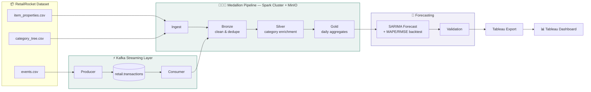

# RetailPulse

**A containerized, streaming-fed demand-forecasting pipeline for e-commerce.**

RetailPulse ingests raw shopping behavior — clicks, cart adds, purchases — from the
[RetailRocket e-commerce dataset](https://www.kaggle.com/datasets/retailrocket/ecommerce-dataset)
(2.7M+ events), streams it through Kafka, processes it on a distributed Spark cluster
through a bronze/silver/gold medallion architecture, and forecasts 14-day transaction
volume per product category using SARIMA — with every forecast backtested and scored, not
just generated. Results are delivered to Tableau as a ready-to-visualize export.
>Tableau DashBoard
(https://public.tableau.com/app/profile/laxmikant.patle/viz/RetailPulse/RetailPulseDemandForecastDashboard?publish=yes)


---

## Why this exists

Retailers lose money in both directions when demand is misjudged — overstocking ties up
cash, understocking loses sales to a competitor. Most dashboards only show *what already
happened*. RetailPulse forecasts what's likely to happen next, broken down by category, so
a planning team can act before a stockout or a warehouse overflow, not after.

---

## Architecture



Every stage above is a single Airflow task (`run_script_task`), executed as an isolated
subprocess in this exact order — `ingest → kafka_producer → kafka_consumer → bronze →
silver → gold → feature_engineering → validation → tableau_export`. Every Spark-backed
task submits to a real standalone Spark cluster (`spark-master`/`spark-worker`), not an
in-process local session.

---

## Key features

- **Event-driven ingestion** — real clickstream data replayed through Kafka into the
  pipeline, not just a direct file read, demonstrating a streaming ingestion pattern ready
  for a live production feed
- **Distributed processing** — PySpark jobs submit to a real standalone Spark cluster
- **Medallion architecture** — bronze (raw), silver (cleaned + category-enriched via a
  bounded recursive category-tree rollup), gold (daily aggregated time series)
- **S3-compatible object storage** — MinIO locally, swappable to real AWS S3 via config
  only (no code changes), thanks to building against the S3A interface throughout
- **SARIMA forecasting with weekly seasonality**, tuned per category and for the overall
  total, forecasting 14 days ahead with 95% confidence intervals
- **Backtested accuracy** — every forecast is validated by holding out the last 14 real
  days, refitting, and scoring the prediction with **MAPE** and **RMSE** — not just
  generating a number and hoping it's right
- **Fully containerized** — one `docker compose up` brings up Airflow, Kafka, the Spark
  cluster, MinIO, and Postgres together, with health-checked startup ordering
- **BI-ready delivery** — forecast results and accuracy metrics both export as clean CSVs
  for direct Tableau consumption

---

## Tech stack

| Layer | Technology |
|---|---|
| Orchestration | Apache Airflow 2.8.1 (subprocess execution model) |
| Processing | PySpark 3.5.1, standalone cluster (`spark-master` / `spark-worker`) |
| Streaming | Apache Kafka 3.7.0 (KRaft mode) |
| Storage | MinIO (S3A) — Bronze / Silver / Gold Parquet |
| Forecasting | `statsmodels` SARIMAX |
| BI | Tableau (CSV export) |
| Infra | Docker Compose |

---

## Repository structure

```
retailpulse/
├── docker-compose.yml        # Airflow, Kafka, Spark cluster, MinIO, Postgres
├── Dockerfile.airflow        # Airflow image + Java + Python deps
├── requirements.txt
├── config/
│   └── pipeline_config.yaml  # storage / spark / kafka / forecast settings
├── dags/
│   └── retailpulse_dag.py    # task sequencing via a single LAYERS list
├── scripts/
│   ├── utils.py               # shared config/Spark/path/logging helpers
│   ├── ingest.py               # lands item_properties + category_tree
│   ├── kafka_producer.py       # replays events.csv into Kafka
│   ├── kafka_consumer.py       # consumes into bronze/events
│   ├── bronze.py               # dedupe/clean
│   ├── silver.py               # category enrichment + hierarchy rollup
│   ├── gold.py                 # daily aggregation
│   ├── feature_engineering.py  # SARIMA forecast + MAPE/RMSE backtest
│   ├── validation.py           # data quality + accuracy logging
│   └── tableau_export.py       # forecast + accuracy CSV export
└── data/
    ├── raw/retailrocket/       # place the 4 Kaggle CSVs here
    └── exports/                # forecast_results_*.csv, forecast_accuracy_*.csv
```

---

## Getting started

**Prerequisites:** Docker Desktop, and the
[RetailRocket dataset](https://www.kaggle.com/datasets/retailrocket/ecommerce-dataset)
downloaded (`events.csv`, `item_properties_part1.csv`, `item_properties_part2.csv`,
`category_tree.csv`).

```bash
git clone https://github.com/LaxmikantPatle/RetailPulse.git
cd RetailPulse

# place the 4 dataset files here:
# data/raw/retailrocket/

docker compose build
docker compose up airflow-init
docker compose up -d
```

Then:
1. Open **http://localhost:8080** (`admin` / `admin`) → unpause and trigger
   `retailpulse_medallion_pipeline`
2. Watch it run — Kafka UI at **http://localhost:8082**, Spark master UI at
   **http://localhost:8081**
3. Grab the output from `data/exports/forecast_results_<date>.csv` and
   `data/exports/forecast_accuracy_<date>.csv`

---

## Methodology notes

- **Category resolution:** an item's category isn't on the event itself — it's resolved
  from `item_properties` (taking each item's most recent `categoryid` snapshot) and rolled
  up to its top-level ancestor via a bounded iterative self-join against `category_tree`
  (Spark doesn't support recursive queries natively).
- **Forecast target:** daily **transaction count** per category, not revenue — the source
  dataset has no price data.
- **Model:** `SARIMAX(order=(1,1,1), seasonal_order=(1,1,1,7))` by default, tunable in
  `config/pipeline_config.yaml`, forecasting the overall total plus the top 10 categories
  by transaction volume.
- **Accuracy validation:** a 14-day holdout backtest per entity, scored with MAPE (mean
  absolute percentage error) and RMSE (root mean squared error).

---

## Known limitations

Being upfront about these rather than letting someone else find them first:

- SARIMA forecasts pattern, not cause — it can't account for a planned promotion, a
  competitor's sale, or an event it hasn't seen before. Treat it as a baseline signal, not
  a final answer.
- No automated tests yet — the category rollup logic (`silver.py`) is the highest-value
  target for unit tests, being the most complex transformation in the pipeline.
- The Kafka setup runs a single broker with replication factor 1 — fine for local
  development, not fault-tolerant, and not representative of a production Kafka cluster.
- Default write mode is `append`; re-running the same date without `--full-refresh` will
  duplicate rows in bronze/silver rather than being a no-op.
- MAPE is undefined (shown as `n/a`) for any entity whose backtest window is entirely
  zero-transaction days — mathematically correct, not a bug.

---

## Roadmap

- [ ] Automated tests for the category hierarchy rollup
- [ ] Stationarity testing (ADF) and AIC/BIC-driven order selection instead of fixed SARIMA parameters
- [ ] SARIMAX with promotional/holiday calendar as exogenous regressors
- [ ] Idempotent pipeline runs (safe re-triggering without duplication)
- [ ] Native Tableau Hyper export (stub already in `tableau_export.py`)

---

## Author

Built by [Laxmikant Patle](https://github.com/LaxmikantPatle).
