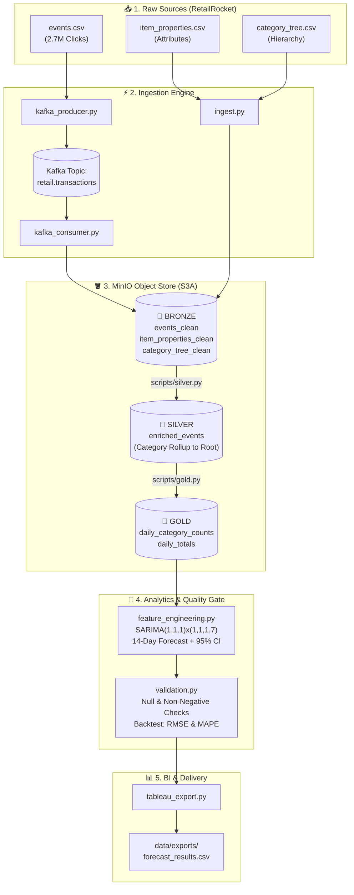
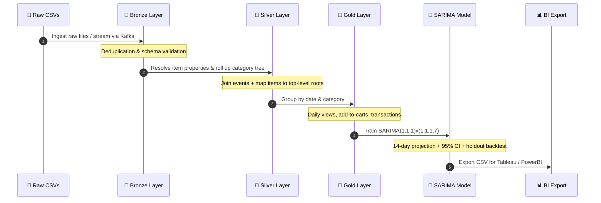
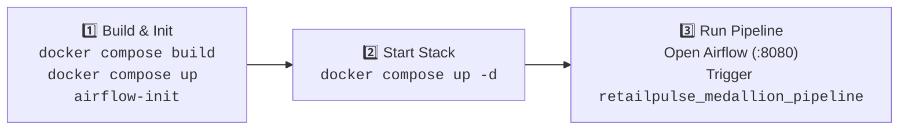

# ⚡ RetailPulse: Medallion Lakehouse & Forecasting Pipeline

[](https://www.python.org/)
[](https://spark.apache.org/)
[](https://airflow.apache.org/)
[](https://kafka.apache.org/)
[](https://min.io/)
[](https://www.docker.com/)

An enterprise-grade, containerized e-commerce data platform that transforms **2.7M raw clickstream events** into **14-day SARIMA demand forecasts** across a multi-tier **Medallion Lakehouse**.

---

## 🏛️ System Architecture



---

## 🔄 The Medallion Data Lifecycle



---

## 🛠️ Tech Stack at a Glance

| Layer | Technology | Function | Port |
| :--- | :--- | :--- | :--- |
| **Orchestration** | Apache Airflow 2.8.1 | DAG scheduling, task retries, execution logging | [`:8080`](http://localhost:8080) |
| **Compute Engine** | Apache Spark 3.5.1 | Distributed transformations, deduplication, joins | [`:8081`](http://localhost:8081) |
| **Object Store** | MinIO (S3-compatible) | Bronze / Silver / Gold Parquet lakehouse storage | [`:9001`](http://localhost:9001) |
| **Event Stream** | Apache Kafka 3.7 (KRaft) | High-throughput clickstream event replay | `:9092` |
| **Stream Monitor** | Kafka-UI | Web inspection of topics, offsets, and messages | [`:8082`](http://localhost:8082) |
| **Forecasting** | statsmodels + pandas | SARIMA time-series model with 14-day forecast | — |
| **Metadata DB** | PostgreSQL 15 | Airflow state, connections, and execution metadata | `:5432` |

---

## 🚀 3-Step Quickstart



### 1. Build & Initialize
```bash
docker compose build
docker compose up airflow-init
```

### 2. Start Containers
```bash
docker compose up -d
```

### 3. Place Data & Trigger DAG
1. Put the [RetailRocket Kaggle files](https://www.kaggle.com/datasets/retailrocket/ecommerce-dataset) in `data/raw/retailrocket/`:
   - `events.csv`
   - `item_properties_part1.csv`
   - `item_properties_part2.csv`
   - `category_tree.csv`
2. Open Airflow at [http://localhost:8080](http://localhost:8080) (`admin` / `admin`).
3. Unpause and trigger `retailpulse_medallion_pipeline`.

---

## 📂 Repository Structure

```
retailpulse/
├── dags/
│   └── retailpulse_dag.py         # Airflow DAG definition
├── scripts/
│   ├── ingest.py                  # Raw CSV -> Bronze Parquet
│   ├── kafka_producer.py          # Clickstream stream producer
│   ├── kafka_consumer.py          # Kafka stream -> Bronze Parquet
│   ├── bronze.py                  # Deduplication & null filtering
│   ├── silver.py                  # Category hierarchy rollup to root
│   ├── gold.py                    # Daily category & platform aggregations
│   ├── feature_engineering.py     # SARIMA fitting, 14-day forecast & backtest
│   ├── validation.py              # Quality gates & error checks
│   ├── tableau_export.py          # Generates Tableau-ready CSV exports
│   └── utils.py                   # Shared Spark/S3/Kafka utilities
├── config/
│   └── pipeline_config.yaml       # Central configuration
├── data/
│   ├── raw/retailrocket/          # Source CSV datasets
│   └── exports/                   # Output forecast CSVs
├── docker-compose.yml             # Full-stack container definitions
└── Dockerfile.airflow             # Airflow + PySpark + dependencies
```

---

## 📈 Deliverables & Visual Dashboards

- 📊 **[Interactive Tableau Demand Forecast Dashboard](https://public.tableau.com/app/profile/laxmikant.patle/viz/RetailPulse/RetailPulseDemandForecastDashboard?publish=yes)**
- `data/exports/forecast_results_<date>.csv`: Historical actuals + 14-day forecasts with 95% confidence bounds.
- `data/exports/forecast_accuracy_<date>.csv`: Model evaluation metrics (RMSE & MAPE) per category.
